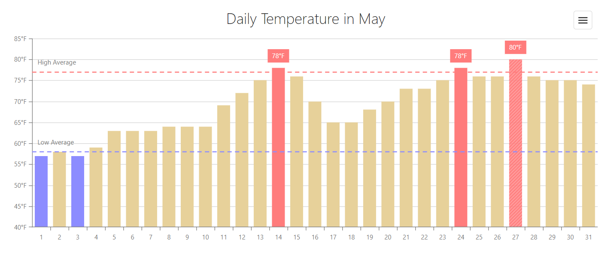
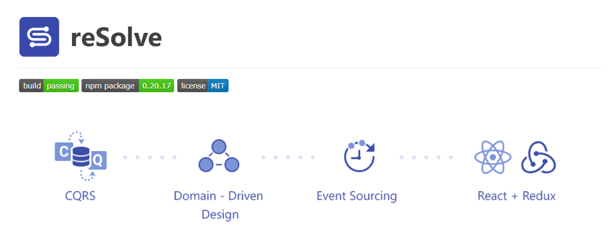

# Projects

## [Devextreme Data Visualization](https://js.devexpress.com/Overview/Charts/)

**Role**: JS Developer

**Stack**:
- JavaScript, ES3, 5, 6
- HTML, CSS
- SVG, VML
- jQuery, Knockout
- UI/UX
- Cross-browser and cross-platform development
- Data visualization
- Test Driven Development
- CI/CD

**Responsibilities**:
- Software development
- Software testing
- Feature requirements
- Market research
- Collaborating with stakeholders
- [Blogs](/blogs) writing

**Description**: Devextreme Data Visualization is a set of JS tools for the data presenting: charts, maps, gauges, sparklines, etc. While my working on this project we had managed to increase a count of customers by 30%.

## Devexpress Analytics Tools

**Role**: Product Owner

## [ReSolve](https://github.com/reimagined/resolve)

**Role**: Product Owner, Scrum Master

## [EasyPay Indonesia](https://easypay.co.id/)

**Role**: Backend Developer, Business Analyst, Product Manager