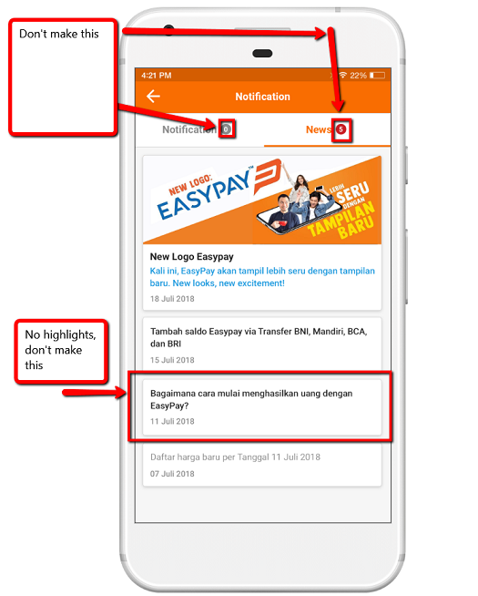
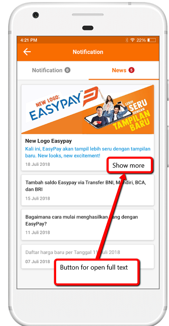
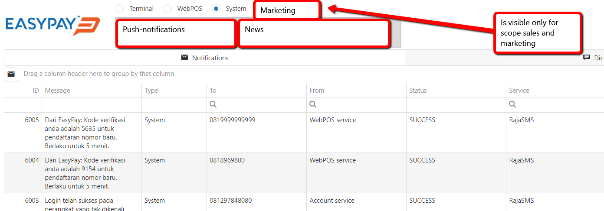
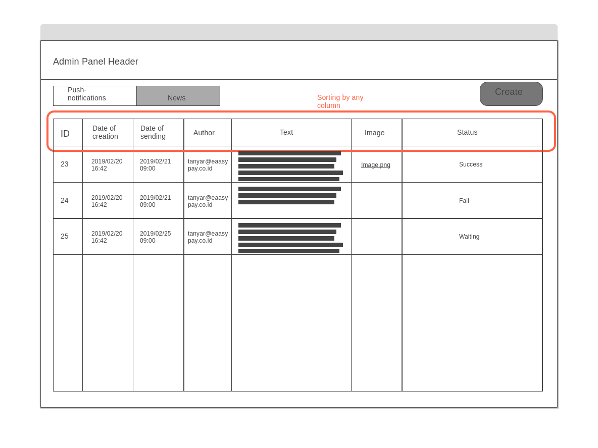
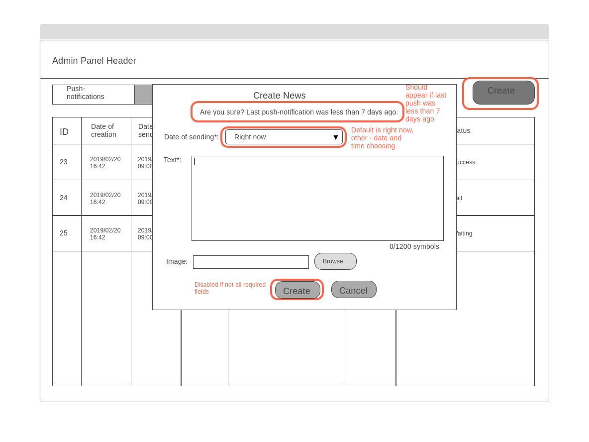

# [Mobile app] [Admin panel] Make news section

#### Description

**Stakeholders:** Arkadiy G., Ivan G.

**Goals:** We should have a connection channel with our agents for sending our news

**Roles:**
1. _Manager_ - who wants to send some information to agents, someone with scope sales or marketing
2. _Agent_ - our agent

**Dictionary:**
_News_ - it's just a message that is going to section "News" in notification panel in mobile app. It has no target group and is sent to all agents.

**User Stories:**
1. As an Agent, I want to be able to open notification panel, so that I can see new and historical news
1.1 Make markup
1.2 Make a way to store news

2. As an Agent, I want to be able to see the News, so that I can see last news
2.1 Make a way to get news with all data

3. As an Agent, I want to be able to open News, so that I can see the full text
3.1 Make markup

4. As a Manager, I want to be able to open News settings, so that I can manage them
4.1 Make markup
4.2 Make a way to get scope

5. As a Manager, I want to be able to see News and their information so that I can analyze historical data
5.1 Make markup
5.2 Make a way to get news with all data

6. As a manager, I want to be able to sort all news so that I can quickly find the news
6.1 Make markup 

7. As a Manager, I want to be able to create the News so that I can send news info to agents
7.1 Make markup
7.2 Make a way to add news

8. As a Manager, I want to see warning if the last News was less than 7 days ago, so that I can change my mind
8.1 Make markup
8.2 Make a way to check last news date

9. As a Manager, I want to be able to set the time of sending, so that I can set the specific date
9.1 Make a way to publish news after creation
9.2 Make a way to publish news at specific date

10. As a Manager, I want to be able to add the text of the message, so that I can set specific text
10.1 Make markup 

11. As a Manager, I want to be able to see the status of created News (Success, Failure, Waiting), so that I can understand in what state is the notification
11.1 Make markup
11.2 Make a way to change news status

12. As a Manager, I want to be able to upload the image for News so that I can attach the picture that will be displayed at mobile app
12.1 Make markup in admin panel
12.2 Make markup in mobile app
12.3 Make a way to add image to news

**Acceptance Criteria&Tests:**

| ID | Criteria | Tests |
|:---:|---|---|
| 1 | Display that agent has new notification in mobile app | **1.** Open the mobile app **2.** Make any News **3.** See that you have new notifications | 
| 2 | Capability to open notification panel | **1.** Open the mobile app **2.** Click to notifications **3.** See notifications panel |
| 3 | Display the News | **1.** Open the mobile app **2.** Click to notifications -> News **3.** See the News | 
| 4 | Capability to open full text of News| **1.** Open the mobile app **2.** Click to notifications -> News **3.** Click to any News **4.** See full text |
| 5 | Capability to open News settings in admin panel | **1.** Open the admin panel with scope sales or marketing **2.** Choose the system section **3.** Open the News settings |
| 6 | Display News | **1.** Open notifications settings **2.** See the News with all necessary information |
| | | **1.** Open the notifications settings **2.** See the notifications **3.** Create the News **4.** See that new News is in the list |
| 7 | Capability to sort data | **1.** Open notifications settings **2.** Sort by any data column **3.** See sorted data |
| 8 | Display warning if last News was less than 7 days | **1.** Open notification settings **2.** Click Create **3.** Don't see the warning **4.** Create News **5.** Click Create again **6.** See the warning |
| 9 | Capability to choose date of sending | **1.** Open notification settings **2.** Create News with "right now" sending **3.** Create **4.** Check that News was added at mobile app |
| | | **1.** Open notification settings **2.** Create News with specific date of sending **3.** Create **4.** At the specific date check that News was added at mobile app |
| | | **1.** Open notification settings **2.** Check that you can choose only future date |
| 10 | Disabled button without required fields | **1.** Open notification settings **2.** Click Create **3.** See disabled button **4**. Fill all required fields **5.** See non-disabled button |
| 11 | Capability to set text | **1.** Open notification settings **2.** Click Create **3.** Input text **4.** Create **5.** Check that News was with specific text |
| | | **1.** Open notification settings **2.** Click Create **3.** Check that you can not add text with ore than 1200 symbols |
| 12 | Display correct status of News | **1.** Open notification settings **2.** Create the News with "right now" date of sending **3.** Check that News was added in mobile app **4.** Check the status of News: success |
| | | **1.** Open notification settings **2.** Create the News with specific date of sending **3.** Check the status: waiting |
| | | **1.** Open notification settings **2.** Create the News with "right now" date of sending **3.** Emulate some errors on server **4.** Check the status: failure |
| 13 | Capability to upload picture | **1.** Open notification settings **2.** Click Create **3.** Upload picture **4.** Fill other fields and create News **5.** Check that in notification panel in mobile app there is this image |
| 14 | Display correct author | **1.** Open notification settings **2.** Create notification **3.** See this notification in the list with correct author |
| 15 | Display correct date of creation | **1.** Open notification settings **2.** Create notification **3.** See this notification in the list with correct date of creation |

#### Additional

Text symbols limit: 1200 symbols