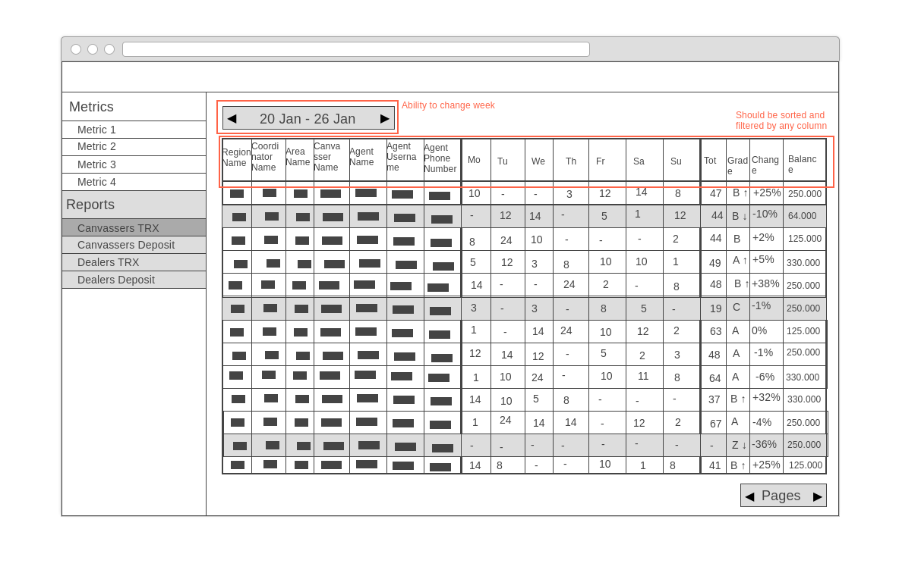
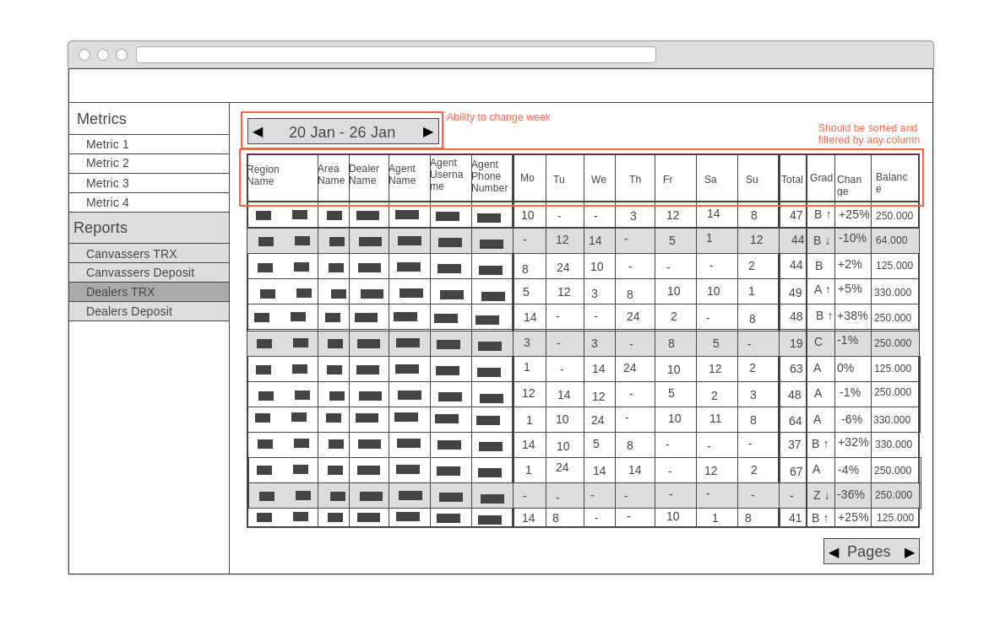
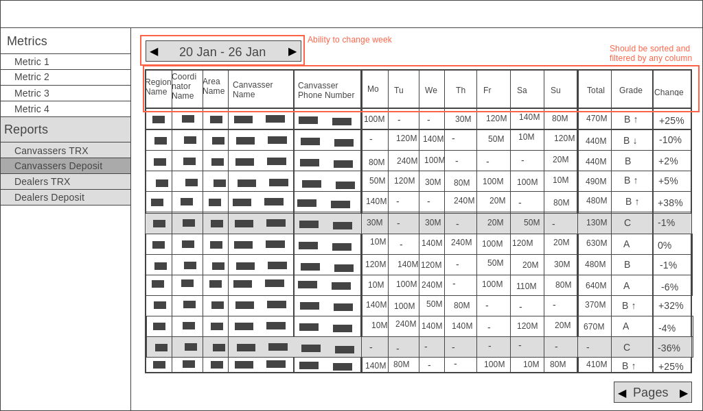
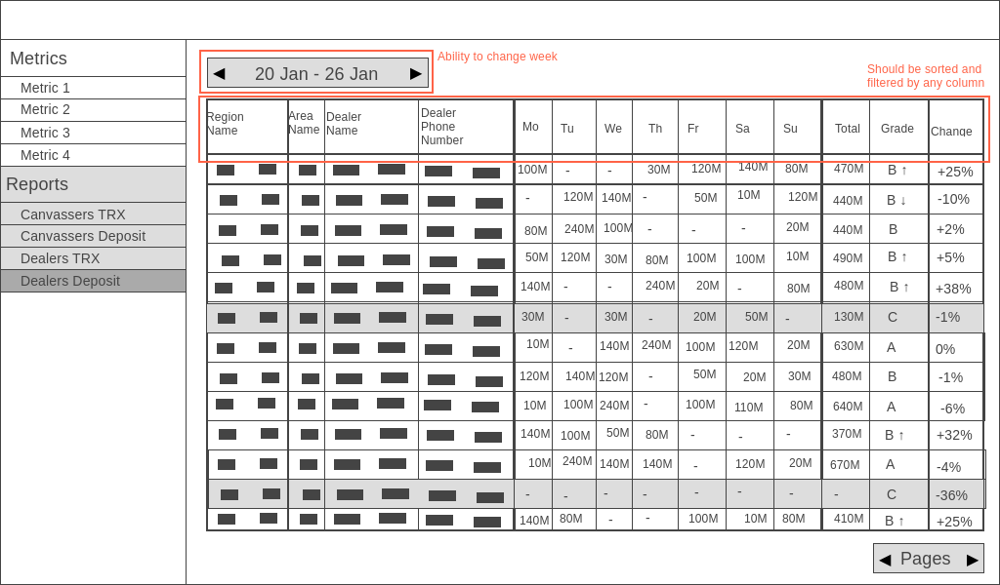

# [Reports] Add transactions and deposit reports for sales department

#### Description

**Stakeholders:** Ivan G.

**Goals:** Sales department use some reports for making decisions. At the moment several people make them manually every week, not in real time. We should automatize this process and provide the sales department with those reports.

**User Stories:**
1. As a manager, I want to be able to open a transaction report for the agents so that I can analyze their work
1.1 Make markup 

2. As a manager, I want to be able to open a transaction report for the dealer's agents so that I can analyze their work
2.1 Make markup 

3. As a manager, I want to be able to open a deposit report for the canvassers so that I can analyze their work
3.1 Make markup 

4. As a manager, I want to be able to open a deposit report for the dealers so that I can analyze their work
4.1 Make markup 

5. As a manager, I want to be able to see all necessary information at transaction report about agents (region name, area name, coordinator name and canvasser name or dealer name, agent name, agent username, agent phone number) so that I can identify them
5.1 Make a way to get information about agents
5.2 Make markup

6. As a manager, I want to be able to see agent's balance so that I can analyze the state of his balance
6.1 Make a way to get balance
6.2 Make markup

7. As a manager, I want to be able to see a count of transactions by weekdays and weekly total at transaction report so that I can analyze how successful is the agent
7.1 Make a way to get count of transactions
7.2 Make a way to calculate total count of transactions
7.3 Make markup

8. As a manager, I want to be able to see the assessment information at transaction report (grade, change) in compiling with the previous week so that I can analyze changes of work
8.1 Make a way to get information about previous week
8.2 Make a way to calculate grade
8.3 Make a way to calculate change
8.4 Make markup

9. As a manager, I want to be able to sort and filter data by any data column at transaction report so that I can analyze data
9.1 Make markup

10. As a manager, I want to see highlighted rows with grade C and Z at transactions report so that I can have a deal with those agents
10.1 Make markup 

11. As a manager, I want to be able to change week for transactions reports, so that I can see historical data
11.1 Make to store information for some period
11.2 Make a way to get information for some period
11.3 Make markup

12. As a manager, I want to be able to see all necessary information at canvasser deposit report for canvassers (region name, coordinator name, area name, canvasser name, canvasser phone number) so that I can identify them
12.1 Make a way to get information about agent
12.2 Make markup

13. As a manager, I want to be able to see all necessary information at dealer deposit report for dealers (region name, area name, dealer name, phone number) so that I can identify them
13.1 Make a way to get information about agent
13.2 Make markup

14. As a manager, I want to be able to see an amount of top ups by weekdays and weekly total at deposit report so that I can analyze the state of deposit
14.1 Make a way to get information about top ups
14.2 Make a way to calculate total top ups amount
14.3 Make markup

15. As a manager, I want to be able to see the assessment information at deposit report (grade and change) in compiling with the previous week so that I can analyze changes of deposit
15.1 Make a way to get information about previous week
15.2 Make a way to calculate grade
15.3 Make a way to calculate change
15.4 Make markup

16. As a manager, I want to be able to sort and filter data by any data column at deposit report so that I can analyze data
16.1 Make markup 

17. As a manager, I want to see highlighted rows with grade C at deposit report so that I can have a deal with those canvassers/dealers
17.1 Make markup 

18. As a manager, I want to be able to change week for deposit reports, so that I can see historical data
18.1 Make a way to store information for some period
18.2 Make a way to get information for some period
18.3 Make markup

19. As a manager, I want to be able to see highlighted rows with balance less than Rp 100.000 so that I can understand on what agents I should pay attention
19.1 Make markup 

**Acceptance Criteria&Tests:**

| ID | Criteria | Tests |
|:---:|---|---|
| 1 | Display the canvassers transaction report | **1.** Open the metric page **2.** Go to canvassers transactions report **3.** See the report |
| 2 | Display the dealers transaction report | **1.** Open the metric page **2.** Go to dealers transactions report **3.** See the report |
| 3 | Display the canvassers deposit report | **1.** Open the metric page **2.** Go to canvassers deposit report **3.** See the report |
| 4 | Display the dealers deposit report | **1.** Open the metric page **2.** Go to dealers deposit report **3.** See the report |
| 5 | Sort data by any data column | **1.** Open the metric page **2.** Go to canvassers transactions report **3.** Choose some column **4.** See sorted data |
| | | **1.** Open the metric page **2.** Go to canvassers deposit report **3.** Choose some column **4.** See sorted data |
| | | **1.** Open the metric page **2.** Go to dealers transactions report **3.** Choose some column **4.** See sorted data |
| | | **1.** Open the metric page **2.** Go to dealers deposit report **3.** Choose some column **4.** See sorted data |
| 6 | Filter data by any data column | **1.** Open the metric page **2.** Go to canvassers transactions report **3.** Filter some column **4.** See filtered data |
| | | **1.** Open the metric page **2.** Go to canvassers deposit report **3.** Filter some column **4.** See filtered data |
| | | **1.** Open the metric page **2.** Go to dealers transactions report **3.** Filter some column **4.** See filtered data |
| | | **1.** Open the metric page **2.** Go to dealers deposit report **3.** Filter some column **4.** See filtered data |
| 7 | Capability to change weeks for report | **1.** Open the metric page **2.** Go to canvassers transactions report **3.** See the report for current week **4.** Choose the previous week **5.** See the report for the previous week **6.** Choose the next week **7.** See the report for current week |
| | | **1.** Open the metric page **2.** Go to dealers transactions report **3.** See the report for current week **4.** Choose the previous week **5.** See the report for the previous week **6.** Choose the next week **7.** See the report for current week |
| | | **1.** Open the metric page **2.** Go to canvassers deposit report **3.** See the report for current week **4.** Choose the previous week **5.** See the report for the previous week **6.** Choose the next week **7.** See the report for current week |
| | | **1.** Open the metric page **2.** Go to dealers deposit report **3.** See the report for current week **4.** Choose the previous week **5.** See the report for the previous week **6.** Choose the next week **7.** See the report for current week |
| 8 | Highlight rows with grades C and Z at transactions reports | **1.** Open the metric page **2.** Go to canvassers transactions report **3.** See that data with grades C and Z are highlighted |
| | | **1.** Open the metric page **2.** Go to dealers transactions report **3.** See that data with grades C and Z are highlighted |
| 10 | Highlight rows with grades C at deposit reports | **1.** Open the metric page **2.** Go to canvassers deposit report **3.** See that data with grade C is highlighted |
| | | **1.** Open the metric page **2.** Go to dealers deposit report **3.** See that data with grades C |
| 11 | Highlight rows with balance less than RP 100.000 at transactions reports | **1.** Open the metric page **2.** Go to canvassers transactions report **3.** See that data with balance |

#### Additional

1. Grade for the transaction report:

It should have view: [Grade Letter] [Grade Vector] 

| Grade Letter | Condition | Color |
|:---:|:---:|:---:|
| A | 7+ transactions | Green |
| B | 3-6 transactions | Yellow |
| C | 1-2 transactions | Red |
| Z | 0 trasactions | Black |

| Grade Vector | Condition | Color |
|:---:|:---:|:---:|
| ↑ | Grade is better than in the previous week | Green |
| ↓ | Grade is worse than in the previous week | Red |
| Nothing | Grade is the same | Nope |

2. Grade for the deposit report:

It should have view: [Grade Letter] [Grade Vector] 

| Grade Letter | Condition | Color |
|:---:|:---:|:---:|
| A | Rp 50.000.000+ total per week | Green |
| B | Rp 15.000.000 - Rp 50.000.000 total per week | Yellow |
| C | Less than Rp 15.000.000 total per week | Red |

| Grade Vector | Condition | Color |
|:---:|:---:|:---:|
| ↑ | Grade is better than in the previous week | Green |
| ↓ | Grade is worse than in the previous week | Red |
| Nothing | Grade is the same | Nope |